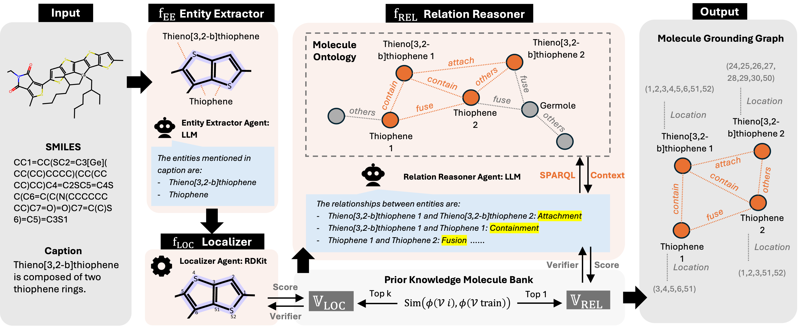

# RelAgent

Multi-agent framework for **molecular relationship grounding**: map (SMILES, caption) → substructures + relationships.



**Pipeline:** Entity Extraction (EE) → Localization → Ontology/context → Relationship Reasoning (REL) → Selection → Evaluation.

---

## Setup

```bash
pip install -r requirements.txt
```

Requires: `rdkit`, `networkx`, `rdflib`, `tqdm`. For E2E runs add `vllm` (GPU).

---

## Usage

**End-to-end** (one molecule → graph; needs vLLM):

```bash
python run_baseline.py --run_e2e --smiles "CC1=CC=CC=C1" --caption "Benzene ring" --model meta-llama/Llama-3.2-1B-Instruct
```

**Evaluate** (precomputed EE + REL outputs):

```bash
python run_baseline.py --test_data data/molground/molground_test.json \
  --rel_outputs path/to/rel_outputs.json --output_dir outputs/my_run --policy first
```

**Build REL prompts** from EE outputs (no LLM):

```bash
python run_baseline.py --test_data data/molground/molground_test.json \
  --ee_outputs path/to/ee_outputs.json --build_prompts_only --prompts_out outputs/prompts.json
```

**Synthetic sanity check:**

```bash
python scripts/generate_synthetic_outputs.py --max_samples 10 --out_dir outputs/synthetic
python run_baseline.py --rel_outputs outputs/synthetic/rel_outputs.json --output_dir outputs/synthetic/run
```

---

## Outputs

Each run writes to one directory. **`run_summary.json`** = config, status, and summary; **`run.log`** = short log. Other files: `metrics.json`, `predictions.json`, `per_sample.json`, `selected.json` (evaluate); `graph.json` (e2e); `prompts.json` (build-prompts).

---

## Layout

| Path | Role |
|------|------|
| `run_baseline.py` | CLI: e2e / evaluate / build_prompts_only |
| `relagent/llm.py` | vLLM: EE + REL generation |
| `relagent/pipeline.py` | Data load, prompts, `run_end_to_end()` |
| `relagent/evaluation.py` | CNER, Grounding (exact + IoU), Relationships |
| `relagent/localizer.py` | RDKit localization + relationship context |
| `relagent/ontology.py` | MolGenie ontology (optional) |
| `relagent/run_recorder.py` | `run_summary.json`, `run.log` |
| `data/molground/` | Test/val data (id, smiles, caption, ground_truth) |

Optional: `data/molgenie/` (MolGenie pickles) for ontology-based context.
